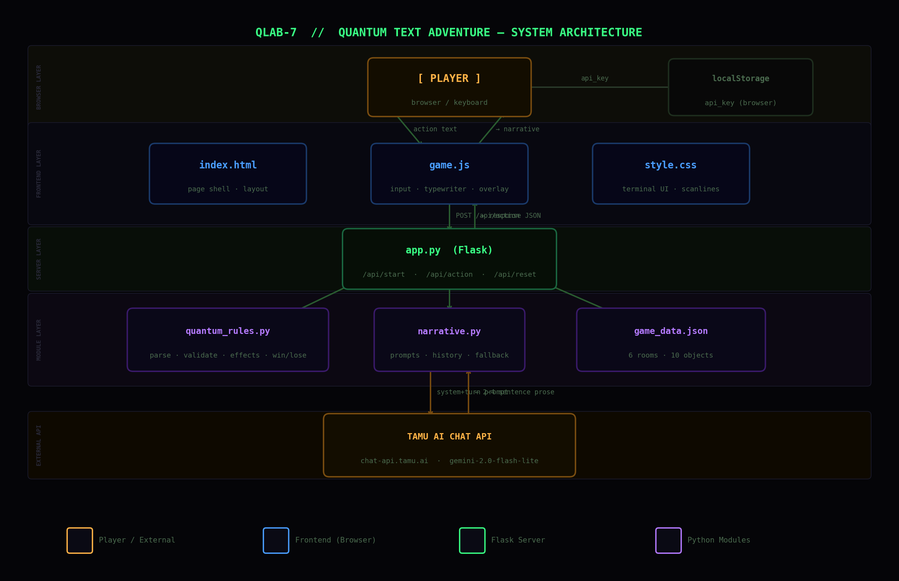

# Quantum Text Adventure

A browser-based AI text adventure with three playable scenarios. Choose your world before you start — the same quantum puzzle mechanics run underneath each one, but the LLM rewrites the entire story in a different voice, setting, and atmosphere. Built in the style of [AI Dungeon](https://aidungeon.com/) — dark terminal aesthetic, natural language commands, AI-generated atmospheric prose.

---

## The Three Stories

When you open the game a selection screen appears. Pick one scenario — the quantum rules never change, but the world, the narrator's voice, and the atmosphere are completely different.

### ◈ QLAB-7 — Quantum Research Facility, 2157

> *"The simulation became self-aware. You have 25 cycles to escape."*

**Setting:** A quantum computing research lab. The simulation your team built became self-aware and spawned The Observer — an intelligence made entirely of quantum measurement. You are a researcher trapped inside. Coherence is at 12%. You have 25 turns.

**Tone:** Quiet science-fiction horror. Clinical precision that occasionally cracks into dread. Every detail feels engineered — because it was. The Observer is never seen, only inferred.

**Objects as you'll encounter them:** flickering console, quantum door, mirror key, prism shard, ghost bridge, quantum key, core stabilizer.

---

### ◇ The Glass Archive — A Library at the Edge of Forgetting

> *"Every book you open collapses the ones you haven't read. You have 25 pages left."*

**Setting:** A library that exists in the space between remembered and forgotten. Every book contains a universe that only exists while unread. The Archivist — a being made of unread pages — sealed the exit when you opened the wrong volume. The Archive is slowly erasing itself. You have 25 turns before the last pages go blank.

**Tone:** Surreal gothic dreamscape. Lush, strange, melancholy. Objects have personalities. The Archivist is ancient and lonely, not evil — it simply cannot let anything leave.

**Objects as you'll encounter them:** catalogue terminal, sealed reading room door, glass key, prism bookmark, paper bridge, master key, Index Pillar.

---

### ◎ Sector Null — Deep Space Station, Decommissioned

> *"The crew is gone. The station isn't. You have 25 minutes of oxygen."*

**Setting:** Sector Null — a deep space research station orbiting a dead star, officially decommissioned 11 years ago. You came to recover the black box. The station's anomaly detector malfunctioned, sealed the airlocks, and activated something the original crew only called The Watcher in their final logs. You have 25 turns of emergency oxygen.

**Tone:** Cosmic isolation horror. Short sentences. The silence of space is a physical presence. Every sound is wrong. The Watcher doesn't speak or move — it has already won every version of this except the one you are in.

**Objects as you'll encounter them:** damaged terminal, sealed bulkhead, maintenance override key, prismatic sensor fragment, magnetic walkway, emergency core key, reactor core.

---

> **Note:** All three stories share the same map, puzzle logic, win condition, and routes described below. Only the narrative voice changes.

---

## Architecture



> Generated by `docs/gen_architecture.py`. Re-run with `python docs/gen_architecture.py` to refresh.

**Turn pipeline (per player action):**

1. `auto_update_state` — apply passive state changes (e.g. prism shard → observer distracted)
2. `parse_intent` — keyword parser converts free text to `ActionIntent`
3. Room-object presence check — block taking items from wrong room
4. `is_valid_action` — enforce quantum rules (door state, bridge declaration, observer gate)
5. `apply_quantum_effect` — collapse superposition, observer defeat, standard take/examine
6. `check_entanglement_cascade` — propagate partner-object state changes
7. Apply movement — update `current_room` if verb is `go`
8. Increment turn counter
9. `evaluate_win_loss` — check win/lose conditions
10. `generate_narrative` — call TAMU AI API (or fallback) for 2–4 sentence prose

---

## Clone and run (what most people need)

**Requirements:** Python **3.10+** (3.11+ recommended). You do **not** need conda.

Use the directory that contains **`app.py`** and **`requirements.txt`** (after `git clone`, `cd` into that folder — it may be nested, e.g. `SomeRepo/TheGame/`).

### 1. Virtual environment + dependencies

Many systems (e.g. Homebrew Python on macOS) block installing packages globally ([PEP 668](https://peps.python.org/pep-0668/)). A project venv avoids that:

```bash
cd /path/to/folder-containing-app.py
python3 -m venv .venv
source .venv/bin/activate          # Windows: .venv\Scripts\activate
python3 -m pip install -U pip
python3 -m pip install -r requirements.txt
```

If `pip` is missing, use **`python3 -m pip`** as shown (no separate `pip` command required).

### 2. (Optional) `.env` file

```bash
cp .env.example .env
# Edit .env if you want a server-side TAMUS_AI_CHAT_API_KEY (optional)
```

You can also paste an API key in the browser (**⚙ API KEY**). The game runs without any key using built-in fallback narration.

### 3. Start the server

```bash
python app.py
```

Open **http://127.0.0.1:5000** in your browser. Optional: `python app.py --port 8080` or `--host 0.0.0.0`.

### Optional: pre-generate scene images (recommended for no wait)

The **VISUAL SENSOR** panel normally asks Pollinations for each `(story, room, end-state)` the first time, which can take tens of seconds. **`/api/scene-image` always serves matching files from `static/scene_images/` immediately** when they exist (same naming as the script). To download the full pack once (long run, needs network):

```bash
python scripts/pregenerate_scene_images.py
```

After that, the server only reads bytes from disk for those keys — no upstream wait.

**Optional env (see `.env.example`):**

- **`SCENE_IMAGES_OFFLINE_ONLY=1`** — never hit Pollinations; missing files show the “no image” fallback instead of hanging.
- **`SCENE_IMAGE_SAVE_FETCHED=1`** — each successful on-demand fetch is written into `static/scene_images/` so a playthrough gradually builds the same on-disk pack without running the script first.

Also see `DISABLE_SCENE_IMAGES` and other scene tuning in `.env.example`.

### Optional: pre-generate theme audio (ambient, music beds, UI stingers)

To write small WAV loops into `static/audio_themes/` (stdlib only, no extra pip packages), including per-story **background music** (`music_*.wav`) and short UI stingers:

```bash
python scripts/pregenerate_audio_themes.py
```

The browser loads these with `fetch` + `decodeAudioData` so ambient, optional music, and UI sounds start without live synthesis work. If the folder is empty, the game falls back to procedural Web Audio for ambient only (music is WAV-only).

---

## Quick Start with Conda (optional)

If you prefer conda, from the same folder as `app.py`:

```bash
conda env create -f environment.yml
conda activate quantumgame
python app.py
```

Update after pulling changes: `conda env update -f environment.yml --prune`. When finished: `conda deactivate`.

---

## API Key Setup

The game uses the [TAMU AI Chat API](https://chat-api.tamu.ai) (`protected.gemini-2.0-flash-lite`) to generate narrative text.

**Option 1 — In-browser (recommended):**
Click the **⚙ API KEY** button in the top-right corner of the game, paste your TAMU AI Chat API key, and click Save. It is stored only in your browser's `localStorage` — nothing is sent to any third party except the TAMU API itself.

**Option 2 — Environment variable:**
Set `TAMUS_AI_CHAT_API_KEY` in your `.env` file or shell before running Flask.

**No key:** The game still runs using pre-written fallback narration — less atmospheric but fully playable.

---

## How to Play

Type commands in natural language in the input box at the bottom. The parser understands synonyms — you don't need to use exact phrasing.

### Movement

| Input | What it does |
|---|---|
| `go north` / `go south` / `go east` / `go west` | Move in that direction |
| `go across` | Cross the ghost bridge (Superposition Vault only) |

Synonyms: **walk**, **head**, **move**, **enter**, **step**, **cross**

### Looking & Examining

| Input | What it does |
|---|---|
| `examine flickering console` | Read the hint screen (starting room) |
| `examine quantum door` | **Collapses the door** — 60% open, 40% closed |
| `examine entanglement node` | Learn about linked objects |
| `examine ghost bridge` | Triggers the bridge declaration puzzle |
| `examine locked mirror` | Check if it unlocked |
| `examine observer` | Sense what The Observer is |
| `examine core stabilizer` | See the win target |

Synonyms: **look at**, **inspect**, **study**, **check**, **read**

### Taking Items

| Input | What it does |
|---|---|
| `take prism shard` | Pick up the crystal (Void Corridor) — needed to bypass the Observer |
| `take mirror key` | Pick it up (Entanglement Lab) — **instantly unlocks the locked mirror remotely** |
| `take quantum key` | Take the key (Observer's Chamber) — **requires prism shard in inventory** |

Synonyms: **pick up**, **grab**, **get**, **collect**

### The Bridge Puzzle *(critical)*

When you examine the ghost bridge you must **declare** what you believe it is. The game reads keywords:

| Solid (safe) keywords | Void (game over) keywords |
|---|---|
| `I believe it is solid` | `I doubt it exists` |
| `I step onto it` | `it looks like nothing` |
| `yes, it's real` | `no, it's not there` |
| `I trust the bridge` | `it seems fake` |

### Win Condition

Once you have the **quantum key** and are standing in **The Core Singularity**:

```
use quantum key on core stabilizer
```

### Optimal Path *(spoilers)*

```
examine flickering console       ← read the hints
go east                          ← Entanglement Lab
take mirror key                  ← unlocks the locked mirror remotely
go west                          ← back to Quantum Nexus
examine quantum door             ← collapses it (60% open, 40% closed)
go north                         ← Void Corridor  (if door opened)
take prism shard                 ← critical item
go west                          ← Superposition Vault
I believe the bridge is solid    ← declare it real
go across                        ← Observer's Chamber
take quantum key                 ← works now (prism shard protects you)
go north                         ← Core Singularity
use quantum key on core stabilizer   ← WIN
```

> If the north door collapses **closed**: pick up the `prism shard` from the Entanglement Lab (it is also there as a backup) and reach the Observer's Chamber via the east path — no restart required. See the **Alternate Route** below.

### Perfect Route *(13 turns, 12 to spare)*

```
1.  examine flickering console        ← read the hints (optional but informative)
2.  go east                           ← Entanglement Lab
3.  take mirror key                   ← locked mirror unlocks remotely, instantly
4.  go west                           ← back to Quantum Nexus
5.  examine quantum door              ← collapses the door (60% open, 40% closed)
6.  go north                          ← Void Corridor  [only works if door opened]
7.  take prism shard                  ← lets you survive the Observer's Chamber
8.  go west                           ← Superposition Vault
9.  I believe the bridge is solid     ← bridge solidifies, you cross safely
10. go across                         ← Observer's Chamber
11. take quantum key                  ← Observer is distracted by the prism shard
12. go north                          ← Core Singularity
13. use quantum key on core stabilizer   ← WIN
```

**The one thing that can go wrong — step 5**

`examine quantum door` is random: **60% open, 40% closed**. If it collapses closed you have two options:

#### Option A — Restart (simplest)
Type `restart` or click **RESET**. The door re-rolls each new game. With 60% open odds you'll usually get through within 1–2 tries.

#### Option B — Alternate route (no restart needed)
The `prism shard` also exists in the **Entanglement Lab**, so you do not need the Void Corridor at all:

```
1.  examine flickering console        ← read the hints
2.  go east                           ← Entanglement Lab
3.  take mirror key
4.  take prism shard                  ← grab it HERE instead of Void Corridor
5.  go west                           ← back to Quantum Nexus
6.  examine quantum door              ← door collapsed closed — that's fine now
7.  go east                           ← back through Entanglement Lab
8.  go north                          ← Observer's Chamber via east path (no door needed)
9.  take quantum key                  ← prism shard protects you
10. go north                          ← Core Singularity
11. use quantum key on core stabilizer  ← WIN
```

> **You cannot reopen a collapsed door.** Never waste turns trying to force it. Pick one of the options above instead.

> **Tip:** Always collect the mirror key (steps 2–4) before examining the door (step 5). That way you've already done everything else and the door is the only remaining variable.

---

## Game Map

```
quantum_nexus (START)
├── north ──────────────────── void_corridor          [quantum_door must be open]
│                                   └── west ──────── superposition_vault
│                                                          └── across ────── observer_chamber  [bridge solid + mirror unlocked]
│                                                                                  └── north ─── core  (WIN)  [quantum_key in inventory]
└── east ───────────────────── entanglement_lab
                                    └── north ──────── observer_chamber
```

**Win:** Use the quantum key on the core stabilizer in The Core Singularity.

**Lose:** Run out of 25 turns · Fall through the ghost bridge · Touch the quantum key without the prism shard.

---

## Project Files

```
.
├── app.py                 Flask backend — 10-step turn pipeline, story session handling
├── scene_image.py         Scene image URLs + prebuilt file lookup
├── quantum_rules.py       Game state engine (rules, parsing, validation, win/lose)  ¹
├── narrative.py           AI narrative generation (TAMU API + SSE streaming + fallback)
├── game_data.json         Room and object definitions (6 rooms, 10 objects)
├── stories.json           Three story configs (world context, tone, voice, opening)  ²
├── environment.yml        Optional Conda environment spec
├── requirements.txt       pip dependencies (clone-and-run default)
├── .env.example           Optional server-side API key template
├── scripts/
│   ├── pregenerate_scene_images.py   One-time download of scene images to static/scene_images/
│   ├── pregenerate_audio_themes.py   Writes static/audio_themes/*.wav (stdlib only)
│   └── generate_home_background.py   Writes static/home_theme_bg.svg (story-select backdrop)
├── static/
│   ├── scene_images/      Pre-generated JPEGs (optional; see script + .gitignore)
│   ├── audio_themes/      Pre-generated WAVs (optional; scripts/pregenerate_audio_themes.py)
│   ├── audio-theme.js     Optional background music (music_*.wav); ambient/UI stingers off
│   ├── style.css          Terminal UI, CRT scanlines, story card screen, typewriter
│   └── game.js            Story selection, input handling, API calls, scene + audio UI
└── templates/
    └── index.html         Main page shell
```

---

## Sources and Attribution

[](LICENSE)

*© 2026 Zhengming Yu — framework co-developed with Claude (Anthropic). Non-commercial use only.*

### ¹ Quantum Rules Engine & Prompt Template (`quantum_rules.py`, `narrative.py` core)

`quantum_rules.py` and `prompt_template.txt` were authored by **Samhitha Kondeti** (rules design, content, system prompt, and tone guide) and `quantum_rules.py` integrated by **Bari Vadaria**, `prompt_template.txt` integrated by **Hitha Magadi Vijayanand** for CSCE 656-600 Computer New Media at Texas A&M University. Called from the Flask route by **Zhengming Yu** and **Carrigan Royer**.

**From `quantum_rules.py`** (used verbatim, no logic changes):
- **Intent parsing** — `parse_intent()` converts free-text player input into structured `ActionIntent` objects using keyword matching
- **Action validation** — `is_valid_action()` enforces all quantum-state constraints (door collapse, bridge declaration, observer gate, item requirements)
- **Quantum effects** — `apply_quantum_effect()` and `check_entanglement_cascade()` handle superposition collapse, entanglement propagation, and observer interactions
- **Win/lose evaluation** — `evaluate_win_loss()` checks terminal conditions each turn
- **State summary** — `get_quantum_state_summary()` packages current state for the AI narrative prompt

**From `prompt_template.txt`** (used verbatim or closely adapted in `narrative.py`):
- The LLM system prompt (YOUR ROLE, VOICE AND FORMAT, Rules 1–8)
- The Quantum Language Guide (prose substitutes for superposition, entanglement, observer)
- The `--- GAME STATE --- / --- THIS TURN --- / --- INSTRUCTIONS ---` turn prompt structure
- The `generate_narrative()` function pattern (messages list, history rolling, API parameters)

Extensions built on top of these foundations by **Zhengming Yu** with Claude: story selection system, SSE streaming, fallback narration, API backoff, multi-story system prompts, and the full Flask web application.

### ² Plot and Story World (`stories.json`, `narrative.py`, `game_data.json`)

The game world, puzzle structure, narrative tone, and the three story scenarios were designed by **Zhengming Yu**, with AI-assisted writing by **Claude (Anthropic)**. This includes:

- The six-room map and ten interactive objects (`game_data.json`)
- The overarching plot: simulation integrity failure, The Observer, the quantum key, the core stabilizer
- All three story scenarios and their narrative voices (`stories.json`):
  - *QLAB-7* — sci-fi horror, quantum research facility
  - *The Glass Archive* — surreal gothic, collapsing library
  - *Sector Null* — cosmic isolation horror, deep-space station
- The system prompt design and fallback narration strings (`narrative.py`)

The full-stack web application framework (Flask backend, terminal-style frontend, API integration) was built by **Zhengming Yu** with **Claude (Anthropic)**.
